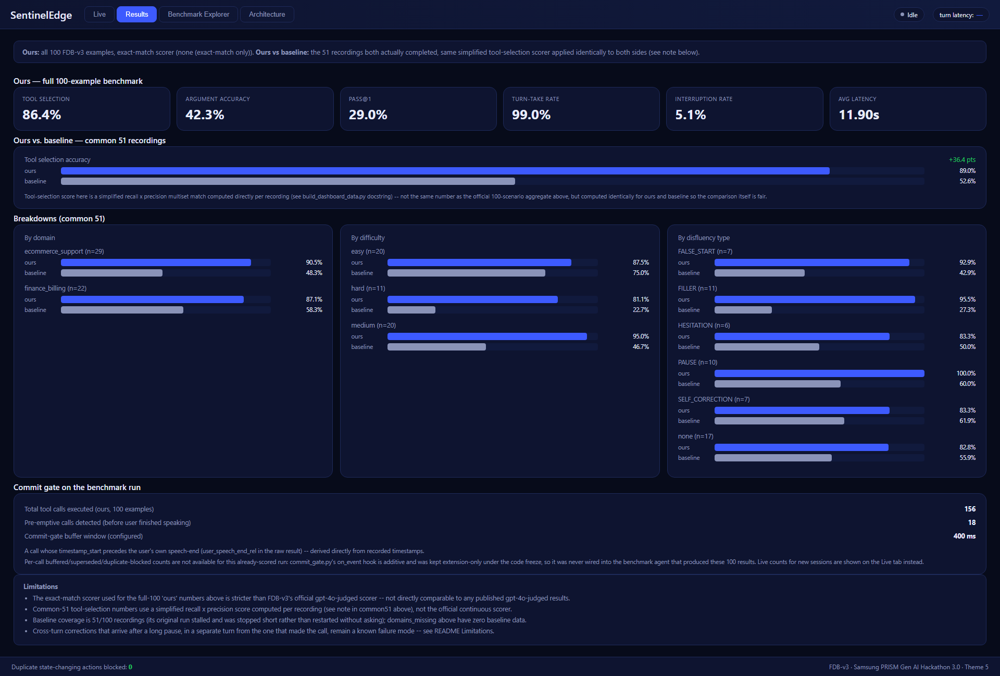
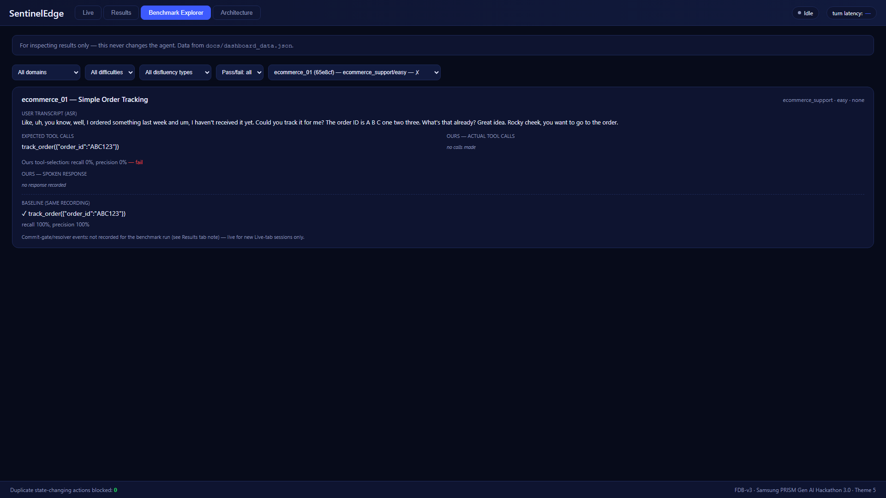
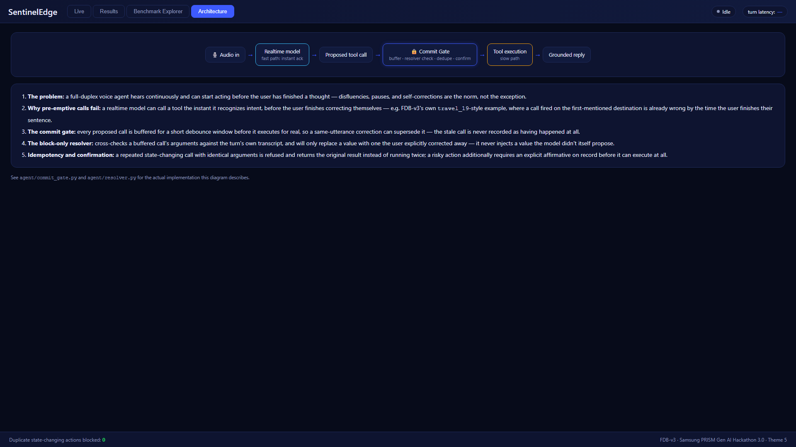
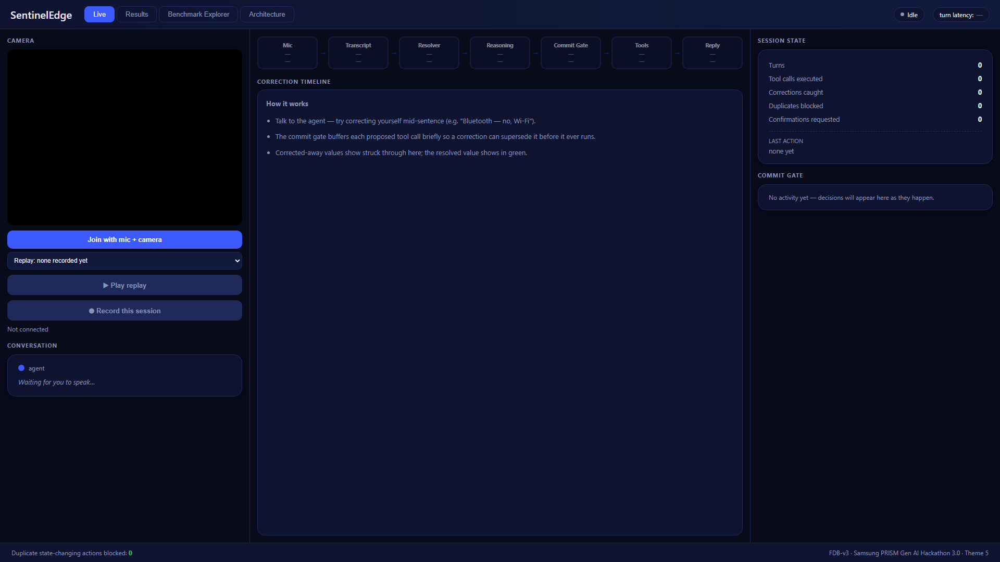

# SentinelEdge — Interruptible Device Support Agent

**Theme 5 submission, Samsung PRISM Gen AI Hackathon 3.0.** A LiveKit voice agent for
full-duplex, interruptible tool use — the kind of agent that has to keep listening while it
talks and acts, so it can hear "actually, no — make that Berlin" and never have already called
the tool for Paris.

## Submission

| | |
|---|---|
| **Theme** | Theme 05 — Interruptible Real-Time Agents |
| **Team** | CodeStorm |
| **College** | SRM Institute of Science and Technology, Kattankulathur |
| **Repository** | https://github.com/Harya018/samsung-prism-Hackathon |
| **Demo video** | [`docs/demo/demo_video.mp4`](docs/demo/demo_video.mp4) |
| **Slide deck** | [`docs/CodeStorm_SRM_Theme05_Submission.pptx`](docs/CodeStorm_SRM_Theme05_Submission.pptx) |
| **Reproduction** | [`scripts/run_fdb_v3.sh`](scripts/run_fdb_v3.sh) — one command, install through evaluate |
| **Declared provider** | Gemini Live (`LK_PROVIDER=gemini2_5`) — see [Declared provider](#declared-provider) |
| **Our best run** | [`results/`](results/) — raw evaluator reports, run config, and an honest note on what they do and don't mean |

**The problem:** a realtime voice model can call a tool the instant it recognizes intent, before
the user finishes a self-correction, a filler-filled pause, or a change of mind. Full-Duplex-Bench
v3 (FDB-v3) scores exactly this — an "extra" call, even a read-only one that got corrected a
moment later, fails the scenario outright.

**The fix, in one sentence:** every proposed tool call is buffered for a short debounce window
before it executes for real (`agent/commit_gate.py`), cross-checked against the turn's own
transcript by a block-only resolver (`agent/resolver.py`) that only ever replaces a value the user
explicitly corrected away, with idempotency and explicit-confirmation guards on top for
state-changing actions.

This repo has three parts:
- **`agent/`** — the commit gate, resolver, and instructions submitted for the FDB-v3 benchmark
  re-run (`scripts/run_fdb_v3.sh`, 60% of the grade).
- **`extension/`** — a second, real-time demo use case built on the same commit gate/resolver: a
  camera-grounded Samsung device-support assistant, with a live dashboard (screenshots below).
- **`scripts/`, `patches/`** — the one-command reproduction pipeline and the harness-reliability
  patches it applies to a stock FDB-v3 checkout (nothing here changes scoring logic).

## Screenshots

**Results** — every number read live from evaluation output, never hardcoded (see [Dashboard](#dashboard) below):


**Benchmark Explorer** — inspect any of the 100 scored recordings, expected vs. actual tool calls:


**Architecture** — the pre-emptive-call problem and how the commit gate/resolver address it:


**Live** — the seven-stage pipeline, correction timeline, and commit-gate feed (idle state shown;
join with mic + camera at `http://localhost:8450` to see it light up):


## Dashboard

`extension/dashboard.html`, served at `http://localhost:8450` by `python extension/web_client.py`
(alongside the extension agent, `python extension/device_agent.py start` — never while a
benchmark run is active). Four tabs:

- **Live** — join with mic + camera and talk to the device-support agent. Left: camera preview
  and a live captioned conversation (both speakers). Center: the seven-stage pipeline (Mic →
  Transcript → Resolver → Reasoning → Commit Gate → Tools → Reply), each stage lighting up with
  a one-line live detail and its latency, plus a correction timeline showing corrected-away
  values struck through and the resolved value in green. Right: session counters (turns, tool
  calls executed, corrections caught, duplicates blocked, confirmations requested) and a
  newest-first commit-gate decision feed. A **Replay** dropdown plays back a recorded session
  through the same rendering code at real speed, clearly labelled while active; a **Record this
  session** button saves the next live session as a replay for later (`extension/replays/*.jsonl`,
  via `POST /api/replays/save`).
- **Results** — every number is read from `docs/dashboard_data.json` (built by
  `scripts/build_dashboard_data.py` from the real `result_*.json`/evaluation-report files, never
  hardcoded): full-100 headline metrics for "ours", an ours-vs-baseline comparison over the 51
  recordings baseline actually completed (never "0.0%"/"n/a" for missing data — labelled "no
  baseline data" instead), breakdowns by domain/difficulty/disfluency type, a "commit gate on the
  benchmark" panel with what's honestly derivable from the frozen run's own recorded timestamps,
  and a limitations footnote (scorer strictness, baseline coverage, the known cross-turn
  correction gap).
- **Benchmark Explorer** — browse and filter all 100 recordings (domain/difficulty/disfluency/
  pass-fail), inspect any one: transcript, expected vs. actual tool calls with ✓/✗ markers, and
  the baseline's result on the same recording where one exists. Inspection only — never changes
  the agent.
- **Architecture** — a five-step explanation of the pre-emptive-call problem and how the commit
  gate, block-only resolver, and idempotency/confirmation checks address it.

Regenerate the Results/Explorer data after any new benchmark run: `python
scripts/build_dashboard_data.py` (writes `docs/dashboard_data.json`). See
`extension/EVENTS.md` for the live data-channel event contract.

## Environment variables

Copy `.env.example` to `.env` (gitignored — never commit it; verify with `git check-ignore .env`).

| variable | required? | used for |
|---|---|---|
| `LIVEKIT_URL` | **required** | LiveKit Cloud project URL (free tier: cloud.livekit.io) — inference streams audio through a LiveKit room |
| `LIVEKIT_API_KEY` | **required** | LiveKit Cloud auth |
| `LIVEKIT_API_SECRET` | **required** | LiveKit Cloud auth |
| `GOOGLE_API_KEY` | **required** | our declared provider — Gemini Live (`LK_PROVIDER=gemini2_5`), via `livekit.plugins.google.realtime.RealtimeModel` |
| `OPENAI_API_KEY` | strongly recommended | the LLM judge (`gpt-4o`) that `evaluate_tool_calls.py`/`evaluate_pass_rate.py --use-llm` always call, regardless of which provider ran the agent — the official policy runs with this judge enabled ("a single pinned judge, so every team is judged identically"), so our local numbers need it too to mean the same thing. `scripts/run_fdb_v3.sh` always uses `--use-llm` (never the proxy judge) whenever this key is set. Also doubles as the key for the optional `gpt_realtime`/`cascaded` providers. |

FDB-v3's own evaluation scripts do **not** need LiveKit — only the inference step does
(`Full-Duplex-Bench/v3/README.md`). Without `OPENAI_API_KEY`, pass `--proxy-llm` to
`run_fdb_v3.sh` to use a Gemini-based PROXY judge instead (same prompts as the official gpt-4o
judge — see "Changes to the benchmark harness" below); every report it produces is labelled
`"judge": "... (PROXY ...)"` so it's never mistaken for the official numbers. Without either,
evaluation falls back to exact-string argument matching — a different, easier-to-game metric
than what actually gets scored.

## Declared provider

**Gemini Live** (`LK_PROVIDER=gemini2_5`, `google.realtime.RealtimeModel`) is our default and
declared provider for the official re-run. `scripts/run_fdb_v3.sh --baseline` runs FDB-v3's own
unmodified template for comparison; `LK_PROVIDER=<other>` (see `RESEARCH_FDB.md` §2) can be used
to compare against other supported providers, but only the Gemini Live run is what gets submitted.

## Quickstart

```bash
cp .env.example .env   # fill in the table above
./scripts/run_fdb_v3.sh --baseline   # FDB-v3's own stock template — establishes the baseline
./scripts/run_fdb_v3.sh              # our agent (agent/lk_agent.py)
```

Results, logs, the exact FDB-v3 commit, and pinned dependency versions land in
`results/{baseline,ours}/<run_id>/`.

## Running with your own benchmark, locally

Everything here — the commit gate, the dashboard, `scripts/build_dashboard_data.py` — is written
against **FDB-v3's own released data format and evaluator scripts**, not something bespoke to
this submission's 100 examples. Point the same pipeline at your own scenarios and your own agent
(or a different comparison baseline) and you get the same dashboard for them. There's no cloud
dependency beyond LiveKit (for streaming audio to your agent during inference) and, optionally,
an LLM judge — evaluation itself runs entirely on your machine.

**1. Your benchmark data**, in `Full-Duplex-Bench/v3/`:
- `benchmark_data_v2.json` — a JSON list, one object per scenario:
  ```json
  {
    "id": "my_scenario_01", "domain": "my_domain", "difficulty": "easy",
    "title": "Short human-readable title",
    "dialogue": [{"user": "...", "ai": "..."}],
    "disfluency_features": ["FILLER"],
    "expected_tool_calls": [{"function": "my_tool", "args": {"key": "value"}}],
    "num_expected_calls": 1, "state_rollback_test": false
  }
  ```
- `fdb_v3_data_released/{scenario_id}_{24-hex-speaker-id}/` — one folder per recording:
  `input.wav` (the user's spoken audio) + `metadata.json`. Multiple folders can share a
  `scenario_id` if you record it with more than one speaker (this submission's own data does,
  for 21 of its 100 — `build_dashboard_data.py`'s docstring explains why that mattered).
- Your own tools: define them the same way `extension/mock_device_apis.py` does (a plain Python
  registry the agent calls into) or however your agent already calls tools — FDB-v3 doesn't care,
  it only ever sees `actual_tool_calls` in the recorded result.

**2. Run inference** for your agent and a comparison baseline (from `Full-Duplex-Bench/v3/`,
reusing FDB-v3's own batch runner unmodified):
```bash
python run_tool_benchmark_all_released.py --provider my_agent_full --infer-only \
  --agent-name my-agent-dispatch-name     # while your LiveKit agent is running and registered
                                           # under that same agent_name (explicit dispatch —
                                           # see patches/livekit_inference.py.diff)
python run_tool_benchmark_all_released.py --provider my_agent_full --asr-only   # score
```
Repeat with a second `--provider` name for whatever you're comparing against (a stock template,
a previous version, another model).

**3. Evaluate** both, naming the output files exactly `{provider}_toolcalls_exact.json` /
`{provider}_pass_rate_exact.json` in `results/` — `build_dashboard_data.py` looks for those
filenames specifically:
```bash
python evaluate_tool_calls.py --benchmark benchmark_data_v2.json --results-dir fdb_v3_data_released \
  --provider my_agent_full --output results/my_agent_full_toolcalls_exact.json
python evaluate_pass_rate.py --benchmark benchmark_data_v2.json --results-dir fdb_v3_data_released \
  --provider my_agent_full --output results/my_agent_full_pass_rate_exact.json
# repeat for your baseline provider name
```
(Add `--use-llm` with `OPENAI_API_KEY` set for the official gpt-4o judge, or `--proxy-llm` for
the Gemini proxy judge, on both — otherwise these fall back to plain exact-match, which is what
`build_dashboard_data.py` currently assumes for its own labelling; if you use a real judge,
update that label where the script reads `evaluated_at`/`judge` from the report.)

**4. Build the dashboard data and view it**, from `fdb-agent/`:
```bash
python scripts/build_dashboard_data.py \
  --fdb-root /path/to/Full-Duplex-Bench/v3 \
  --provider-ours my_agent_full --provider-baseline my_baseline_full \
  --commit-gate-buffer-ms <your CommitGate's buffer_ms>
python extension/web_client.py   # serves the dashboard at http://localhost:8450
```
Open `http://localhost:8450`, click **Results** or **Benchmark Explorer** — every number and
every per-example row is read from the file you just built, nothing else needs to be running.
The **Live** tab additionally needs your own agent process up and registered (see `extension/
device_agent.py` for a worked example of wiring a LiveKit agent to the dashboard's data-channel
events — `extension/EVENTS.md` documents the contract it expects).

## Changes to the benchmark harness

`scripts/run_fdb_v3.sh` applies a small set of patches to the FDB-v3 checkout before running
anything (`scripts/patch_fdb_v3.py`, applying `patches/*.diff`). **Every one of them is harness
reliability only — none change scoring logic, what counts as a correct tool call, or the
official judge's behavior.** Full detail, reasons, and exact diffs: `patches/README.md`. In
short:

- Two real upstream bugs, fixed as compatibility patches: a CUDA-availability check that crashed
  unconditionally on any CPU-only machine, and a plugin-import-timing issue against current
  `livekit-agents` releases.
- A real pre-existing bug in the benchmark's own `--asr-only` re-scoring mode: it silently
  dropped tool-call telemetry (`room_name` was never restored from a prior result), so a rescore
  pass would report zero tool calls for every scenario regardless of what the agent actually did.
- Reliability fixes for running this benchmark on a single CPU-only machine: a subprocess timeout
  on the per-example inference call (previously unbounded — a dead agent hung the whole run
  forever), a lower LiveKit worker `num_idle_processes`/higher `load_threshold` (the default tries
  to keep `cpu_count()` warm processes ready, which overloads a laptop), and an `--infer-only` /
  `--asr-only` two-phase split so NeMo's CPU-heavy transcription never runs while the agent is
  live accepting job dispatches.
- An opt-in `--proxy-llm` judge (Gemini, identical prompts to the official gpt-4o judge) for
  environments without `OPENAI_API_KEY`. **Opt-in only, never the default** — `run_fdb_v3.sh`
  always uses the official `--use-llm` (gpt-4o) path unless `--proxy-llm` is passed explicitly,
  and every report the proxy judge produces is labelled as such. Note: the free-tier Gemini
  quota (20 requests/day/project) cannot cover a full-100 run's ~200 judge calls, so treat proxy
  numbers from a full run as indicative only — use `--use-llm` with an `OPENAI_API_KEY` for
  numbers you'd cite.

## Limitations

- **Same-utterance self-correction is handled; cross-turn correction (after a pause, in a
  separate turn) is not.** The commit gate's debounce buffer (`agent/commit_gate.py`) correctly
  resolves a correction that arrives *within* the same continuous utterance — e.g. "flights to
  Paris — actually, no, make that Berlin" never fires the Paris call, because the resolver sees
  the correction before the buffer's debounce window closes. But once the model has already
  emitted a tool call and moved on to a **new turn**, there is no buffer left to intercept a
  correction that arrives later. Two observed failures of exactly this kind: `travel_10`
  (Miami → Paris) and `finance_12` (100 → 150) — in both, the agent's stale call had already
  fired *before* a correction that came after a long pause, in what the transcript treats as a
  separate turn rather than a continuation of the same one.
  - We deliberately did not attempt a fix for this after the code freeze. The two real fixes we
    considered — (a) a **provisional-vs-confirmed commit** state for read-only calls, so a
    same-session correction can still retract a call whose result hasn't been spoken back to the
    user yet, and (b) **longer semantic endpointing**, holding the turn open across a pause when
    the transcript alone can't yet tell whether the user is done or mid-correction — both change
    turn-taking/commit timing behavior broadly enough that we didn't want to risk it against a
    frozen, already-scored agent this late. This is also not a gap unique to our approach: the
    FDB-v3 paper itself (arXiv 2604.04847) treats disambiguating a genuine cross-turn correction
    from an unrelated new request as an open problem for full-duplex tool-use agents, not a
    solved one.
- **`ecommerce_01` (1/100 in the scored `ours_full` run) came back with an empty transcript** on
  two separate attempts, with no exception or state change in the agent's own log — read as a
  rare Gemini Live session-activation flake rather than a reproducible bug, and left as a
  documented residual gap rather than retried indefinitely.
- **The Gemini proxy judge cannot score a full 100-example run** (see "Changes to the benchmark
  harness" above) — a structural quota limit of the free tier, not something patchable in this
  codebase. It remains useful for spot checks and the 17-example verification subset.

## What's next

- Provisional/confirmed commit state for read-only tool calls, to close the cross-turn
  correction gap above without touching same-utterance debounce behavior that's already working.
- Longer, adaptive semantic endpointing keyed on disfluency-feature likelihood rather than a
  fixed pause duration, so a genuine mid-thought pause and a completed turn are told apart more
  reliably before a call commits.
- Extend the extension's (`extension/`) per-stage latency telemetry back into the benchmark path
  itself (currently extension-only, gated off the scored agent by design) once there's a UI to
  consume it, to make future cross-turn-correction failures diagnosable from timing data instead
  of manual transcript reading.
